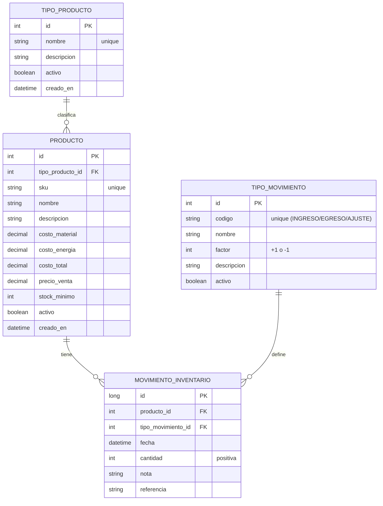

```mermaid
erDiagram
  TIPO_PRODUCTO ||--o{ PRODUCTO : "clasifica"
  PRODUCTO ||--o{ MOVIMIENTO_INVENTARIO : "tiene"
  TIPO_MOVIMIENTO ||--o{ MOVIMIENTO_INVENTARIO : "define"

  TIPO_PRODUCTO {
    int id PK
    string nombre "unique"
    string descripcion
    boolean activo
    datetime creado_en
  }

  PRODUCTO {
    int id PK
    int tipo_producto_id FK
    string sku "unique"
    string nombre
    string descripcion
    decimal costo_material
    decimal costo_energia
    decimal costo_total
    decimal precio_venta
    int stock_minimo
    boolean activo
    datetime creado_en
  }

  TIPO_MOVIMIENTO {
    int id PK
    string codigo "unique (INGRESO/EGRESO/AJUSTE)"
    string nombre
    int factor "+1 o -1"
    string descripcion
    boolean activo
  }

  MOVIMIENTO_INVENTARIO {
    long id PK
    int producto_id FK
    int tipo_movimiento_id FK
    datetime fecha
    int cantidad "positiva"
    string nota
    string referencia
  }

```